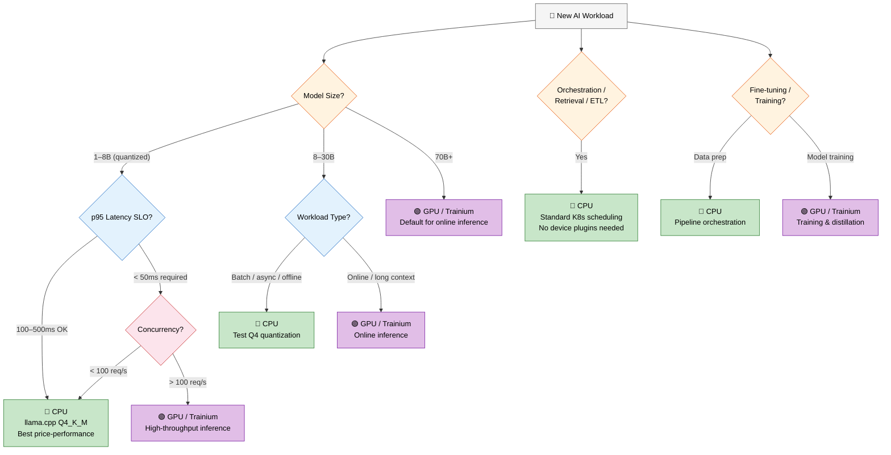
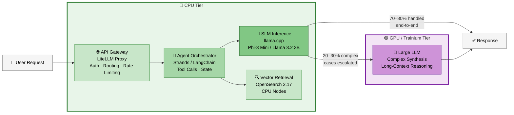
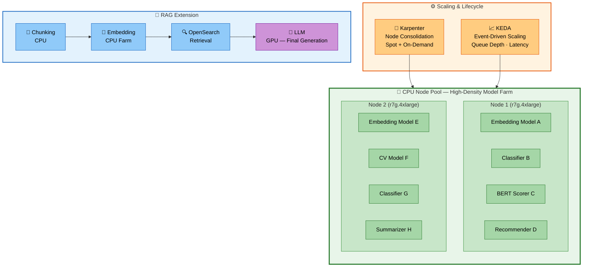
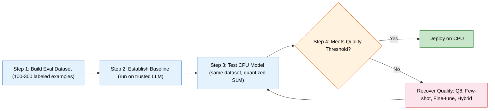

import Admonition from '@theme/Admonition';

# CPU Inference and Orchestration on EKS

## TL;DR

CPU instances are a first-class compute option for a wide range of AI workloads on Amazon EKS. From small language models (SLMs) and classical ML inference to data pipelines and agent orchestration, CPUs offer strong price-performance, broad capacity availability, and familiar Kubernetes scheduling semantics. A deliberate CPU-first strategy lets you build resilient, cost-efficient AI architectures without sacrificing quality where it matters most.

The framing matters: CPU and GPU are complementary, not competitive. As agentic AI pipelines grow in complexity, the CPU workload surface grows with them — every inference call is surrounded by tool execution, context assembly, vector search, guardrails, and orchestration logic that all run on CPU. The right architecture uses both, and this guide helps you draw the line.

Production AI pipelines in 2026 are heterogeneous. Not every workload needs a GPU — most of the **work** in a real AI pipeline doesn’t require one. Routing, classification, retrieval, embedding, orchestration, and a growing share of language model inference all run effectively on CPU.

Recent CPU generations — both arm64 and x86 — have made the economics compelling, with strong price-performance for ML inference across instance families. Add Karpenter's node consolidation, KEDA's event-driven scaling, and quantized model serving via `llama.cpp`, and you have a production-ready stack that platform teams can operate without deep GPU expertise.

**This guide is for:**

* **Platform engineers** designing multi-tenant EKS clusters for AI workloads.
* **ML practitioners** evaluating inference backends for models under 30B parameters.
* **FinOps** teams looking for concrete cost levers without sacrificing SLOs.


**What you’ll learn:**

* Understand which AI workloads belong on CPUs and where GPUs or Trainium are genuinely necessary.
* How to apply a four-dimensional decision framework to any new workload.
* Two production patterns with CPUs: agentic SLM pre-filtering and high-density model farms.
* Advanced optimizations: quantization, bin-packing, Spot scheduling, and observability.

**Key caveat:**

<Admonition type="caution" title="Benchmark Before You Commit">
Every recommendation in this guide includes a benchmark reminder. The right instance family (arm64, x86, GPU, or Trainium) depends on your model, data, and latency budget. Use this guide as an informed starting point, then validate empirically.
</Admonition>

## Why CPUs for AI Workloads?

Architecture conversations on EKS often default to GPU-first thinking. Sometimes that’s appropriate. Often, it isn’t.  The reality is that production AI pipelines are heterogeneous: CPUs anchor the control plane and much of the inference load, while GPUs and accelerators handle the compute-intensive peaks.

Three things make the CPU argument compelling right now:

**Capacity availability.** GPU instances frequently require capacity reservations weeks in advance. CPU instances are broadly available across all AWS regions with no specialized device plugins, no DRA configuration, and no MIG partitioning. When you need to scale fast, CPU is the fastest lever to pull.

**Economics.** Current-generation CPU instances deliver strong price-performance for ML inference. For teams running FinOps reviews or managing multi-tenant clusters, the cost delta between CPU and GPU is material — especially for quantized SLMs where GPU acceleration provides diminishing returns. Benchmark across available instance families (Graviton, AMD, Intel) to find the best $/token for your workload.

**Operational simplicity.** CPU pods use standard Kubernetes scheduling (`requests`, `limits`, node affinity, topology spread). No device plugins, no custom schedulers, no `nvidia.com/gpu` resource types. Teams that want to run AI workloads without deep GPU expertise can get to production faster on CPU.

And this trend is accelerating. In agentic AI pipelines, every GPU inference call is surrounded by CPU work: tool execution, context assembly, vector search, embedding lookups, guardrails, response validation, memory management, and orchestration logic. As agents get more complex — more tools, longer chains, multi-step reasoning — the CPU workload grows super-linearly. Protocols like MCP (Model Context Protocol) amplify this further: each MCP tool call triggers data retrieval, transformation, and formatting that runs entirely on CPU. The result is that CPU compute demand in agentic systems grows faster than GPU demand.

## CPU vs GPU / Trainium: When to Choose Each

|Factor	|Choose CPU	|Choose GPU/Trainium	|
|---	|---	|---	|
|Model Size	|SLMs 1-8B (quantized); embeddings; classifiers	|8B+ for low-latency online inference; 70B+ in general	|
|Latency SLO	|p95 100-500ms acceptable	|p95 < 50 ms required	|
|Concurrency	|< 100 req/s per endpoint	|> 100 req/s sustained	|
|Workload Type	|Orchestration, retrieval, ETL, batch scoring	|Online inference, fine-tuning, training	|
|Capacity	|Immediate availability, no reservations	|Often requires reserved capacity	|
|Cost Sensitivity	|CPU delivers best $/token for eligible workloads	|GPU amortizes at high utilization	|
|Team Expertise	|Standard Kubernetes operations	|Requires GPU operations knowledge	|
|Data Sovereignty	|SLM inference in VPC; full audit trail; data never leaves your account	|Same if self-managed; not available with external APIs	|

<Admonition type="tip" title="Benchmark Reminder">
These thresholds are starting points. Run `llama.cpp` on your target instance family (e.g., c7g, c7a, c7i) with your actual model and traffic pattern before committing.
</Admonition>

## Workload Decision Framework

Choosing the right compute for an AI workload comes down to four dimensions:

1. **Model size and precision**: Does quantization keep quality within your acceptable range?
2. **Latency and throughput SLOs**: What are your p50/p95 targets and peak requests rates?
3. **Workload Types:** Online inference, batch scoring, retrieval or orchestration?
4. **Cost and Capacity constraints:** FinOps budget, regional availability, reservation strategy?

The following flowchart captures the decision logic. Start from your model size and follow the path:



Use the table below as your decision matrix. It reflects practical thresholds.

|Workload	|CPU	|GPU / Trainium	|Notes	|
|---	|---	|---	|---	|
|SLMs (1–8B params, quantized) - Phi-3 Mini, Llama 3.2 3B, Qwen2.5 7B	|Default choice. Strong price-perf at 100–500ms latency, moderate QPS. Benchmark across instance families.	|When p95 &lt;50ms or concurrency &gt;100 req/s.	|llama.cpp Q4_K_M or Q8_0 recommended	|
|Medium models (8–30B params) - Llama 3.1 8B, Mistral 7B	|Batch, async, offline scoring. Test Q4 quantization.	|Online inference, long contexts, tight latency.	|Benchmark Q4 across instance families	|
|Large LLMs (70B+ params) - Llama 3.1 70B	|Non-real-time only, heavy quantization	|Default for production online inference	|Even 70B can run on CPU; expect high latency	|
|Classical ML / Embeddings / CV	|High-density serving; bin-pack across nodes.	|Heavy vision or multi-modal at scale.	|TorchServe, Triton on CPU handles thousands of models.	|
|Data pipelines / ETL / Synthetic data	|Ray and Spark on CPU for data prep and feature engineering.	|N/A	|CPUs anchor this entire data prep stage	|
|Agent orchestration / RAG retrieval	|Network-bound services — API gateways, LiteLLM proxy, retrievers, chunkers.	|N/A	|Network-bound; benefits from high-bandwidth CPU instances.	|
|Fine-tuning / Training	|Data prep and pipeline orchestration.	|Model training and distillation.	|Hybrid: CPU prep → GPU train → CPU infer.	|
|Compliance-sensitive inference (FSI, healthcare, government)	|SLMs in VPC on CPU. Data stays in-account, full audit trail.	|Same if self-managed on GPU.	|CPU wins on cost for sub-8B models in regulated environments.	|

<Admonition type="warning" title="70B+ Models on CPU: Proceed with Caution">
While it is technically possible to run 70B models on CPU with heavy quantization (Q4 or lower), this is only viable for non-real-time, offline, or batch workloads. Expect token generation rates in the low single digits (1–5 tokens/sec), memory requirements exceeding 40GB even at Q4, and latency measured in minutes per response for longer outputs. For any interactive or latency-sensitive use case, 70B+ models belong on GPU or Trainium. Do not plan production online inference around CPU for models of this size.
</Admonition>

### Quick Benchmark Workflow

Before committing to an instance family, run a structured benchmark comparing your candidate CPU families (arm64 and x86) and GPU on a single comparable metric: **cost-per-1,000-queries at your target p95 latency**. Deploy one node per family with identical model configuration (same quantization, context size, thread count), load-test each, and compare. If a CPU instance meets your p95 SLO, it almost certainly wins on cost. If it misses by a small margin, try the latest generation in that family before reaching for GPU. If latency is still too high at your concurrency target, that's the signal to move the workload to GPU.

<Admonition type="info" title="Companion Benchmarking Guide">
A dedicated performance benchmarking guide with step-by-step instructions, tooling recommendations, and worked examples is planned as a companion to this document.
</Admonition>

## Production Patterns

### Pattern 1: Agentic AI -  SLM Pre-Filter on CPU with LLM Escalation

Most agent workflows execute the same narrow patterns repeatedly: classify the request, pick a tool, extract structured data, validate a response. These tasks don't require a 70B parameter model.

NVIDIA's research on SLMs ([arXiv:2506.02153](https://arxiv.org/abs/2506.02153)) demonstrates that models under 10B parameters, when specialized for a domain, can match or exceed large LLMs on constrained sub-tasks, while running efficiently on CPU at significantly lower cost and latency. When a model is fine-tuned for a specific domain, its smaller footprint can actually make it *more accurate and cheaper* than invoking a general-purpose LLM.

**The practical pattern:** An SLM on CPU handles the majority of requests end-to-end. A routing layer — also running on CPU — escalates only genuinely complex cases to a GPU-hosted LLM.



**Components running on CPU:**

* API gateway / LiteLLM proxy - handles auth, routing, rate limiting
* Agent orchestrator (Strands, LangChain) - manages tool calls and state
* SLM inference service - `llama.cpp` or Ray Serve with Phi-3 Mini or Llama 3.2 3B
* Vector retrieval - OpenSearch 2.17 on CPU nodes

**Components on GPU/Trainium:**

* Heavyweight LLM for complex synthesis, long-context reasoning

**Why this pattern works:** You cut LLM invocations significantly. In many agentic workflows, 70-80% of requests are classifiable or extractable by an SLM. But the savings go beyond inference: for every LLM call you avoid, you also avoid the surrounding CPU work of assembling a large context window, running expensive guardrails on a long response, and managing complex state. The routing layer itself is a simple CPU service, and the entire CPU tier scales independently from the GPU tier.

The CPU workload categories in a typical agentic pipeline include: tool execution (MCP server calls, API calls, database queries), context assembly, vector search and embedding lookups, orchestration and planning logic, guardrails and safety filtering, response validation and formatting, agent memory and state management, and logging/observability. As agent complexity grows — more tools, longer chains, multi-step reasoning — these CPU workloads grow super-linearly. MCP adoption accelerates this: each new tool integration adds data retrieval, transformation, and formatting work that runs entirely on CPU.

This pattern also fits a fine-tuning lifecycle: collect domain data on CPU nodes, fine-tune on GPU, then deploy the quantized model back to CPU for inference, at substantially lower cost than an LLM endpoint. Research from LoRA Land ([arXiv:2405.00732](https://arxiv.org/abs/2405.00732)) shows that fine-tuned 7B models beat GPT-4 on 25 out of 31 domain-specific tasks — making the "fine-tune a small model and run it on CPU" path viable for most production use cases.

### Pattern 2: High-Density CPU Model Farm

Not every AI workload is a language model. Production ML pipelines routinely deploy hundreds or thousands of smaller models: embeddings, recommenders, classifiers, BERT-based scorers, and computer vision models. Individually lightweight, these models become expensive when assigned their own GPU resources.

**The solution:** High-density CPU serving (bin-packing multiple models per node using TorchServe or Triton on CPU), with Karpenter managing node lifecycle and KEDA scaling on observed load.



**This pattern extends naturally into RAG architectures:** embedding generation, document chunking, and retrieval from OpenSearch 2.17 all run cost-effectively on CPU nodes, feeding results to a GPU-hosted LLM only for the final generation step. The CPU farm handles the volume; the GPU handles the complexity.

For regulated industries (financial services, healthcare, government), this pattern is especially compelling: hundreds of specialized models running in-VPC on CPU, with full audit trails and data that never leaves the account. The compliance requirement for self-managed inference aligns naturally with the cost advantage of CPU for sub-8B models.

## Optimization Best Practices

With provisioning and scaling in place, a few optimizations make a real difference in production.

### **1. Quantization: start here.**

Running a 7B model at full BF16 on CPU is impractical; running it at Q4 with llama.cpp is viable and cost-effective.

**Recommended approach:** Build llama.cpp with architecture-optimized BLAS backends (ARM NEON/SVE2 for arm64, AVX-512/AMX for x86), setting n_threads equal to the vCPU count, and selecting Q4_K_M or Q8_0 quantization formats for the best balance of quality and throughput.

|Quantization	|Quality Impact	|Throughput vs BF16	|Use Case	|
|---	|---	|---	|---	|
|Q4_K_M	|Low (< 1% perplexity delta)	|~4–5x faster	|Production default for SLMs	|
|Q8_0	|Negligible	|~2x faster	|Quality-sensitive tasks	|
|Q5_K_M	|Very low	|~3.5x faster	|Balance of quality and speed	|
|BF16	|None	|1x (baseline)	|Avoid on CPU for 7B+ models	|

For sub-2B models (gemma-2b, qwen-0.5b, SmolLM-135M), CPU actually wins on price-performance vs GPU. These models are small enough that GPU acceleration provides minimal benefit while the per-hour cost is significantly higher. If your workload can use a sub-2B model, CPU is the unambiguous default.

**Architecture-specific optimizations:** On arm64, Graviton4 instances (`r8g`, `c8g`) add SVE2 support — build `llama.cpp` with `-march=armv9-a+sve2`. On x86, AMD EPYC instances (`c7a`, `m7a`) support AVX-512, and Intel Sapphire Rapids instances (`c7i`, `m7i`) add AMX for matrix acceleration. Use the appropriate compiler flags for your target architecture to get the best throughput.


<Admonition type="tip" title="Benchmark Reminder">
Q4_K_M quality degradation varies by model and task. Always evaluate on your evaluation set before deploying to production.
</Admonition>

### **2. Bin-packing for dense serving.**

For classical ML and embedding models (typically &lt;500MB each), the goal is **maximum pod density per node at stable tail latency**. Two things determine whether you achieve that: accurate resource requests, and controlled threading. Everything else is secondary. Base your `requests` on observed p50–p90 usage under realistic load. Use Goldilocks, VPA recommendations, or Prometheus histograms from a load test, but never guess. Defaults are almost always wrong in both directions.

ML libraries (PyTorch, ONNX Runtime, MKL, OpenBLAS) will spawn as many threads as they can see vCPUs on the node, not the CPUs allocated to the pod. On a dense node with 20 pods, that means every pod tries to spawn 32 threads. The node thrashes on context switching and p99 latency spikes. Fix it explicitly:

```
env:
  - name: OMP_NUM_THREADS
    value: "2"          # match your cpu request (2000m = 2 threads)
  - name: MKL_NUM_THREADS
    value: "2"
  - name: OPENBLAS_NUM_THREADS
    value: "2"
  - name: INTRA_OP_NUM_THREADS    # PyTorch / ONNX Runtime
    value: "2"
  - name: NUM_INTER_THREADS
    value: "1"          # keep inter-op parallelism minimal to avoid nested spawning
```

Set each value equal to or below your CPU request. For pods with 4+ cores, benchmark starting at 2-4 threads. Many small models perform better with fewer threads due to cache efficiency. If you use HPA with many thin pods, 1–2 threads per pod almost always wins.

### **3. Scheduling and cost optimization**

Two practices compound to reduce CPU inference costs significantly: Spot instances with Karpenter consolidation, and multi-arch container images.

Karpenter's consolidation works well for CPU inference because stateless inference pods behind a queue or load balancer tolerate interruption gracefully. Configure consolidation to act on underutilized nodes with a budget that limits concurrent disruption (e.g., 20% of nodes at a time) to avoid capacity dips during scale-down. Karpenter's `nodePool` spec lets you mix Spot and On-Demand capacity in a single pool, with Spot as the preferred option and On-Demand as fallback.

Building multi-arch images (`arm64` and `amd64`) unlocks this further. With both architectures available, Karpenter can select from the full range of instance families — Graviton, AMD, Intel — based on real-time price and availability. This is especially valuable for Spot workloads where diversifying across instance types and architectures reduces interruption frequency. Use `docker buildx` or a CI pipeline with multi-platform builds to produce a single manifest that covers both architectures.

### 4. Observability: instrument early

Without observability at the model layer, you're scaling blindly. Expose Prometheus metrics for every inference service and use them to drive both KEDA scaling and operational dashboards.

**Key metrics to instrument:**

|Metric	|Description	|Alerting Threshold	|
|---	|---	|---	|
|`llama_tokens_per_second`	|Throughput per replica	|Alert if < 50% of baseline	|
|`llama_pending_requests`	|Queue depth	|Scale trigger at > 5	|
|`llama_request_duration_ms`	|End-to-end latency histogram	|Alert on p95 > SLO	|
|`llama_model_load_time_seconds`	|Cold start time	|Alert if > 30s	|
|`container_memory_working_set_bytes`	|RSS memory per pod	|Alert at 85% of limit	|

## Evaluating Model Quality for CPU-First Workloads

Deploying a quantized SLM on CPU is a cost and latency decision. It only makes sense if the model still produces correct, useful outputs for your workload. This section explains how to validate that.

The tradeoff is clear: smaller models or quantization cut compute cost but can reduce quality. The impact varies, sometimes negligible, sometimes severe. The workloads that shine on CPU (classification, extraction, routing, summarization, embeddings) often retain good quality in the 3B–7B range with proper quantization and prompting.

### What to evaluate

Different workloads degrade in different ways. Here are a few common examples.

| Workload | What may degrade | What to measure |
|---|---|---|
| Intent or ticket classification | Errors on ambiguous inputs | Accuracy, F1 per class |
| Structured extraction (JSON) | Missing fields or wrong schema | Exact match, schema validity |
| RAG answers | Hallucinations or ignoring context | Faithfulness, answer relevance |
| Summarization | Missing facts or poor coverage | ROUGE-L, BERTScore, human review |
| Agent routing | Selecting the wrong tool | Tool accuracy |
| Embeddings | Worse retrieval quality | Recall@K, NDCG |

### A practical evaluation workflow

The goal is to create a **quality check before production**, similar to how you would run a load test before choosing an instance type. The workflow has four stages:



Build a small evaluation dataset (100-300 labeled examples) from your actual workload — avoid generic benchmarks like MMLU that measure general reasoning rather than your real task. Establish a quality baseline by running the dataset against a trusted model (e.g., GPT-4o or a large Llama). Then run the same dataset on your quantized SLM and compare. Define your quality threshold before testing — for example, "SLM accuracy within 5 percentage points of baseline." The right threshold depends on the task: a classifier reviewed by humans can tolerate more errors than a system making automatic decisions.

### How to recover quality

If the model performs poorly, try these in order of effort:

* **Add few-shot examples in the prompt**: Zero cost, immediate. Including 3-5 labeled examples in the prompt often closes the gap for classification and extraction tasks.
* **Use a higher-quality quantization format**: Moving from Q4 to Q8 often restores much of the lost quality, at the cost of ~2x more memory and lower throughput.
* **Use hybrid routing**: Let the SLM handle simple cases and send difficult inputs to a larger model. This is an architectural change but keeps your CPU cost low for the majority of traffic.
* **Fine-tune the model on your domain**: The most expensive option, but the most effective. Research from LoRA Land ([arXiv:2405.00732](https://arxiv.org/abs/2405.00732)) found that fine-tuned 7B models beat GPT-4 on 25 out of 31 domain-specific tasks.

## Conclusion


Most of the work in a production AI pipeline — routing, classification, retrieval, orchestration, and a growing share of inference — runs well on CPU. As agentic workloads grow in complexity, the CPU surface grows faster than the GPU surface: every inference call is surrounded by tool execution, context assembly, vector search, and orchestration that all run on CPU. Current-generation CPU instances across arm64 and x86 deliver strong price-performance for these workloads. Q4_K_M quantization on `llama.cpp` makes 7B models viable on CPU, sub-2B models are unambiguously cheaper on CPU than GPU, and Karpenter + KEDA + Spot give you cost-optimal scaling without sacrificing availability.

For regulated industries where data sovereignty requires in-VPC inference, CPU-based SLMs offer the best combination of cost, compliance, and operational simplicity.

The thresholds in this guide are informed starting points. Your model, data, and SLOs determine the right answer — benchmark before you commit.

### Resources and Further Reading

|Resource	|Link	|
|---	|---	|
|Amazon EKS Documentation	|https://docs.aws.amazon.com/eks/	|
|AWS Graviton Developer Guide	|https://github.com/aws/aws-graviton-getting-started	|
|Karpenter Documentation	|https://karpenter.sh/docs/	|
|KEDA Documentation	|https://keda.sh/docs/	|
|llama.cpp GitHub	|https://github.com/ggerganov/llama.cpp	|
|Ray Serve Documentation	|https://docs.ray.io/en/latest/serve/	|
|Amazon OpenSearch Service	|https://docs.aws.amazon.com/opensearch-service/	|
|AWS Spot Best Practices	|https://docs.aws.amazon.com/AWSEC2/latest/UserGuide/spot-best-practices.html	|
|LoRA Land: Fine-Tuned Open-Source LLMs that Outperform GPT-4	|https://arxiv.org/abs/2405.00732	|
|Model Context Protocol (MCP) Specification	|https://modelcontextprotocol.io	|
|Small Language Models are the Future of Agentic AI (NVIDIA)	|https://arxiv.org/abs/2506.02153	|
